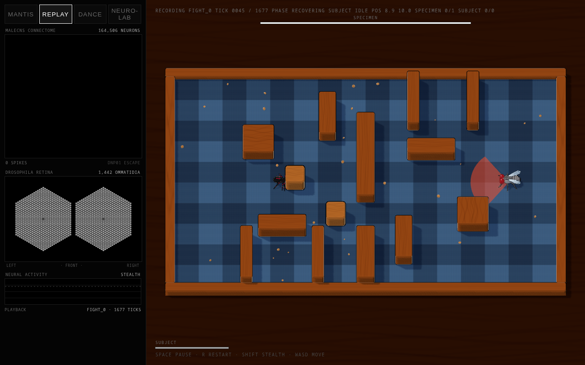
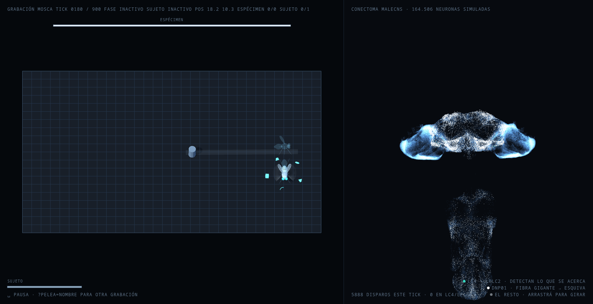
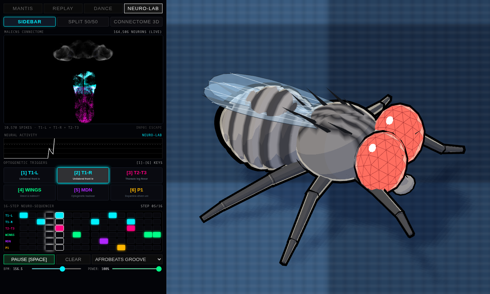
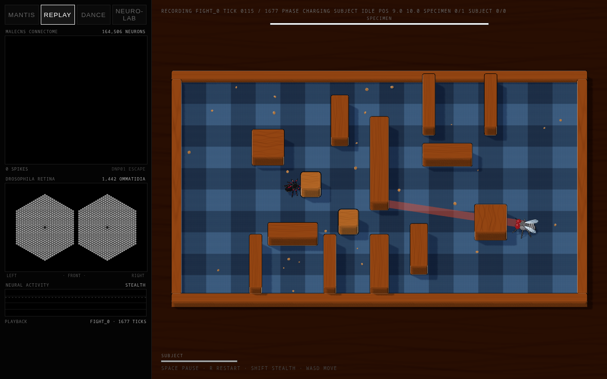
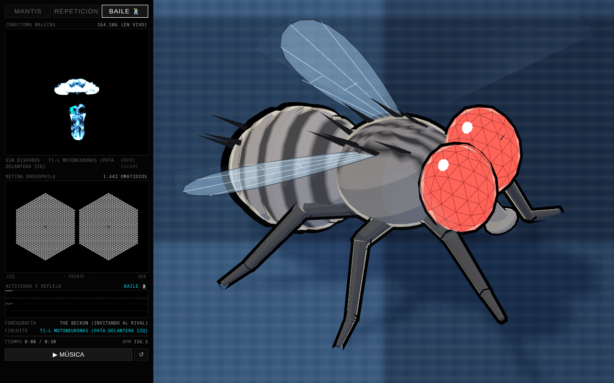

<div align="center">

# 🪰 FlyBrain

**A video game boss controlled in real time by the biological connectome of a fly.**

[](engine/)
[](web/)
[](web/)
[-blue.svg?style=flat-square)](https://neuprint.janelia.org/)
[](engine/tests/)
[](training/)
[](LICENSE)

<br/>

*Not a behavior tree. Not a policy trained with deep reinforcement learning.*  
Driven by a biophysical simulation of **leaky integrate-and-fire (LIF)** neurons running directly over the full biological wiring diagram of the adult *Drosophila melanogaster* central nervous system — the **MaleCNS v1.0** dataset from Janelia/FlyEM (~164,506 neurons, public under CC-BY 4.0).

[Live Demo & Modes](#-interactive-web-modes) •
[Architecture](#-architecture--components) •
[Biological Circuits](#-validated-neurobiology--circuits) •
[Determinism](#-bit-for-bit-determinism) •
[Quickstart](#-quickstart-in-3-minutes) •
[Español](README_es.md)

---


*The simulation in action: orthographic Three.js physical arena, 1,442-ommatidia biological Drosophila retina, live neural telemetry, and a boss guided by real neural reflexes and motor neurons.*

</div>

---

## ⚡ Current Project Status

| Action / Subsystem | Biological Circuit Connected | Status | Empirical Validation |
|---|---|---|---|
| **Dodge / Evasion** | Visual looming (`LC4` + `LPLC2`) → Giant Fiber (`DNp01`) | **Validated** | 30x–70x selective spike ratio over randomized visual controls |
| **Locomotion (Walk)** | 381 Ventral Nerve Cord (VNC) leg motor neurons | **Validated** | Asymmetric bilateral drive + tactile leg wall-avoidance reflex |
| **Lunge (Attack)** | Rival cVA pheromone (`DA1_lPN`) → Kenyon Cells → `MBON` valence | **In testing** | Mushroom Body Output Neuron valence balance triggers lunges |
| **Reward / Punishment** | Dopaminergic `PAM` (hits) & `PPL1` (damage received) | **Measured** | Selectively depresses `KC→MBON` synapses in respective lobes |
| **Compound Eye Vision** | 1,442 hexagonal ommatidia with egocentric azimuth mapping | **Implemented** | Direct retinal projection rendered to WebGL canvas |

> **Milestone:** The fly now drives three primary boss actions. When an incoming projectile or attack approaches, looming optical expansion excites the innate Giant Fiber (**DNp01**), commanding a precision dodge. When walking, propulsion emerges from the integrated firing rates of 381 VNC leg motor neurons, with mechanical leg feedback steering it away from walls. When the olfactory threshold for rival pheromones is crossed, the Mushroom Body Output Neuron valence balance triggers a lunge.

---

## 📸 Capabilities & Visual Showcase

### 1. Escape Reflex on the Intact Connectome (164,506 Neurons)
When an opponent or hazard rushes in, the looming visual circuit fires lobula projection neurons `LC4` and `LPLC2` in tight temporal synchrony. This excitation converges monosinaptically onto the giant descending interneuron `DNp01` in the cervical connective, triggering an immediate escape maneuver.

<div align="center">
  
  <p><em>Interactive 3D point cloud of 164,506 neurons in MaleCNS: cyan activation in the optic lobes and white action potential burst along descending giant fiber DNp01.</em></p>
</div>

### 2. Neuro-Lab: In Silico Optogenetics & 16-Step Neural Sequencer
An interactive neuro-stimulation console allowing direct excitation of identified neural clusters (prothoracic motor neurons `T1-L` and `T1-R`, leg flexors `T2-T3`, wing flight motor `WINGS`, backward-walking interneuron `MDN Moonwalker`, and courtship/aggression interneurons `P1`) to examine real-time kinematic responses on the 3D Drosophila anatomical rig.

<div align="center">
  
  <p><em>Neuro-Lab interface: 16-step motor pattern sequencer with adjustable tempo and live joint angle feedback.</em></p>
</div>

### 3. Attack Telegraphing & Decal Warning
Adhering to high-skill action game design, every boss technique projects its upcoming area of effect on the ground via a dynamic decal during its windup frames, giving human players a tight 200 ms reaction window to dodge or seek cover.

<div align="center">
  
  <p><em>Lunge telegraph warning decal projected across the tabletop arena.</em></p>
</div>

### 4. Biomechanical Locomotion & Courtship Display
Reproduction of rhythmic motor coordination (courtship song and gait) driven by frequency oscillators and real-time audio spectral analysis at 156.5 BPM.

<div align="center">
  
  <p><em>Close-up kinematic inspection: unilateral wing vibration, leg extension, and thoracic motor neuron activation.</em></p>
</div>

---

## 🔬 Why This Approach?

Recent viral projects connected fly connectomes to games like *Doom* or *Super Mario 64*. While inspiring, they face fundamental design mismatches:
1. **Arbitrary, complex discrete controls** completely alien to insect physiology.
2. **Extremely sparse and delayed reward signals**, requiring millions of trial-and-error runs for any emergence.
3. **Severe performance bottlenecks**: heavyweight game engines unable to execute high-volume parallel simulations.

**FlyBrain solves this by inverting the design:**
The combat engine was engineered from scratch as a **pure mathematical function in Rust**. It is deterministic down to the single bit, runs headless at **over 1,000,000 steps per second in Python**, and replays identically at 60 FPS in any modern browser via **WebAssembly**.

---

## 🏗️ Architecture & Components

```
FlyBrain/
├── engine/        Rust. Core physics, collisions, combat, and damage simulation.
│   │              Pure function: no I/O, no global state, no uncontrolled randomness.
│   ├── wasm32     → Compiled to WebAssembly for client-side replay & simulation.
│   └── pyo3       → Python C-extensions exposing high-throughput VecEnv (Rayon).
├── fly/           Python. The biophysical fly:
│   │              MaleCNS connectome represented in sparse CSR/CSC matrices,
│   │              vectorized LIF simulator, and empirical biological validation suites.
├── web/           TypeScript + Three.js.
│   │              Pure WebGL presentation layer: orthographic arena, 3D
│   │              connectome visualizer, biological retina, and Neuro-Lab console.
├── assets/        Production-grade screenshots and documentation media.
├── arenas/        Declarative map geometry in JSON format.
└── training/      VecEnv performance benchmarks and Python harnesses.
```

### The Unified Integration Boundary

The engine does not decide what the boss does; it receives actions through a single clean entrypoint:

```rust
pub fn step(w: &mut World, input: PlayerInput, action: BossAction) -> StepEvents
```

All interactions are packed into compact fixed-width structures:

#### 1. Sensory Input (43-Dimensional Egocentric Observation):
* **16** Azimuth raycasts: Euclidean distance to the nearest static/dynamic obstacle.
* **2** Direct line-of-sight (LOS): clear or obstructed, plus target distance.
* **10** Opponent kinematics: relative position, velocity vector, health, action phase, and invulnerability frames.
* **9** Boss self-state: health, cooldown timers for 5 tools, active phase, and arena boundary proximity.
* **5** Global context: match clock, damage momentum, and opponent's last 3 actions.
* **1** **Looming signal**: optical expansion rate of approaching threats ($\frac{2rv}{d^2}$), directly driving `LC4` and `LPLC2`.

#### 2. Motor Output (Quantized to 2 Bytes):
`Idle`, `Move(angle)`, `Use(tool, param)`, and `Deploy(support, direction)`. Arsenal includes hammer, cannon, shockwave, dash lunge, and dodge roll.

#### 3. Dense Reinforcement Gradient (Dopaminergic Modulation):
$$r = +0.01 \cdot \text{damage\_dealt} - 0.001 \cdot \text{damage\_taken} - 0.05 \cdot \text{whiff} - 0.0005 \cdot \text{passivity}$$

The *whiff* penalty (attacking open air without making contact) provides an immediate credit assignment signal that separates aiming from blind aggression, biologically mapped to dopaminergic inputs `PPL1` and `PAM`.

---

## 🔒 Bit-for-Bit Determinism

A fight simulated across millions of steps on a remote GPU cluster must reproduce in the browser **bit-by-bit identical**, otherwise replay verification and neural causality break down. This invariant is enforced by three core rules:

1. **Strict `libm` usage:** Trigonometric and transcendental operations (`sin`, `cos`, `atan2`, `exp`) use software-implemented `libm` routines instead of native `f32` methods, eliminating hardware FPU drift between x86 and WebAssembly.
2. **Self-contained PCG32 PRNG:** Custom pseudo-random generator in [`engine/src/rng.rs`](engine/src/rng.rs), isolating runs from external crate updates.
3. **Fixed-step integration:** Strict $dt = \frac{1}{60}\text{ s}$ tick cadence without floating time deltas.

The verification test suite validates this invariant automatically:
```bash
cargo test                        # 114 unit and integration tests
./scripts/wasm-determinism.sh     # Asserts identical crypto-hashes: Native vs WASM
node scripts/wasm-smoke.mjs       # Verifies browser binding serialization
cd web && npm run check           # Headless browser WebGL and combat execution test
```

---

## 🎮 Interactive Web Modes

Launch the local development server with `./scripts/dev.sh` to explore all interfaces:

* **`/?modo=replay&pelea=fight_0` (Combat Replay Mode):**  
  Replays recorded battles frame-by-frame with precise synchronization between physics, WebGL rendering, the ommatidia compound eye, and connectome spike activity.
* **`/?modo=neuro` (Neuro-Lab):**  
  Interactive optogenetics playground featuring a 16-step rhythm sequencer. Craft neural spike trains and observe their biomechanical expression on the anatomical rig.
* **`/?modo=mantis` (Mantis Stealth Stalking):**  
  Player stealth challenge. Sneak up on the fly from behind. If your approach speed or angle generates an optical looming rate exceeding the `LC4/LPLC2` firing threshold, the giant fiber fires and the fly escapes within milliseconds.
* **`/?modo=baile` (Courtship & Locomotion):**  
  Audio-reactive showcase set to 156.5 BPM illustrating bilateral leg coordination and wing display routines.

---

## 🧠 Validated Neurobiology & Circuits

FlyBrain extracts functional subgraphs from **MaleCNS v1.0** and runs the LIF simulator under biologically grounded operating regimes:

```
Baseline Noise:    1.5 - 2.0 (ensures spontaneous silence in resting state without runaway seizure)
Synaptic Scale:    0.01 - 0.07 (plateau regime preventing recurrent inhibition wash-out)
LIF Integration:   dt = 0.1 ms (~167 biophysical solver steps per 60Hz game tick)
```

### Key Circuits & Literature Foundations
- **Looming Detection & Escape:** Lobula columnar neurons `LC4` and `LPLC2` projecting monosynaptically to descending Giant Fiber `DNp01` (*von Reyn et al., 2014*; *Ache et al., 2019*).
- **Walking Coordination & Motor Neurons:** 381 motor neurons in the ventral nerve cord driving six articulated legs (coxa, femur, tibia) based on *Pugliese et al. (2025)*.
- **Olfaction & Aggression Drive:** 11-cis-vaccenyl acetate (cVA) pheromone sensory pathway via antenna lobe glomerulus `DA1` projecting to mushroom body Kenyon Cells (*Wang & Anderson, 2010*).
- **Dopaminergic Synaptic Plasticity:** Heterosynaptic depression of $KC \to MBON$ synapses modulated by dopaminergic clusters `PAM` and `PPL1` (*Aso et al., 2014*).

---

## 🚀 Quickstart in 3 Minutes

### Prerequisites
- **Rust** 1.80+ (`curl --proto '=https' --tlsv1.2 -sSf https://sh.rustup.rs | sh`)
- **Node.js** 20+ and `npm`
- **Python** 3.10+ (optional, for connectome experiments)

### 1. Test the Simulation Engine (Rust)
```bash
cargo test
```

### 2. Launch the Web Application (Combat, Neuro-Lab & Connectome)
```bash
./scripts/dev.sh
# Open http://localhost:5173 in your browser
```

### 3. Download Connectome & Run Biophysical Experiments (Python)
```bash
# Download MaleCNS dataset (540 MB, public Janelia bucket)
python fly/paso0.py --descargar

# Validate the escape reflex (visual looming -> giant fiber)
python fly/sobresalto.py

# Benchmark vectorized Python environment throughput
pip install maturin && maturin develop --release
python training/env_smoke.py
```

---

## 📜 Credits & License

- **Engine & Architecture:** Created by [Jhongdlp](https://github.com/Jhongdlp), adapted from the core engine of [EPOCH](https://github.com/Jhongdlp/EPOCH).
- **Connectome Dataset:** MaleCNS v1.0 courtesy of **Janelia Research Campus / FlyEM Project Team** under **CC-BY 4.0**.
- **Code License:** Open source under the **MIT License** (see [`LICENSE`](LICENSE)).
